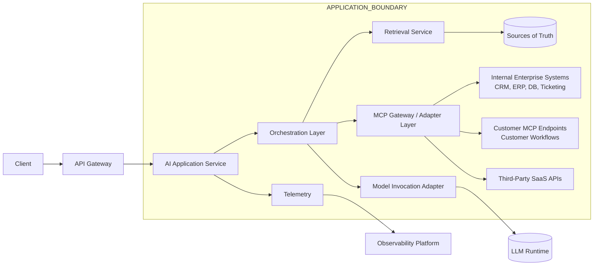

ENTERPRISE ARCHITECTURE RECOMMENDATION

---

# 1. Core Principles

1. Truth is externalized.
2. Retrieval precedes reasoning.
3. Boundaries are explicit.
4. Observability is first-class.
5. Tool use is governed.
6. Fail safely.

---

# 2. Recommended Reference Architecture

# 3. System Boundaries

## 3.1 Application Boundary (Enterprise-Owned)

**You own and are accountable for:**

- **Authentication / Authorization**
  - Session identity, RBAC/ABAC, tenant isolation
- **Retrieval and grounding**
  - Query rewrite, hybrid search, rerank
  - Permission trimming and document-level ACL enforcement
  - Citation rules and “no evidence → no claim” enforcement
- **Prompting and orchestration**
  - Prompt templates and versioning
  - Routing and model selection policy
  - Tool governance and step planning
- **Safety controls**
  - Prompt-injection defense, policy enforcement, PII/DLP checks
  - Redaction and safe output formatting
- **Operational controls**
  - Budgets (token caps, tool call caps, timeouts)
  - Retry/fallback behavior and circuit breakers
- **Telemetry and auditability**
  - Structured logs, metrics, traces, and audit events
  - Correlation IDs across API → orchestration → retrieval → model → tools

---

## 3.2 Model Boundary (Provider-Owned)

**The provider-managed model/runtime owns:**

- Token generation and decoding
- Context window management
- Latency/error characteristics of the inference endpoint
- Model-specific behavior and capabilities

**Key constraints to assume:**

- Outputs are **probabilistic** (plausible, not guaranteed correct)
- The model is **not** your enterprise system-of-record
- The model does **not** inherently know tenant-specific or current enterprise facts
- You cannot rely on the model for governance, authorization, or audit trails

---

# 4. Truth Strategy

## 4.1 Parametric Memory

**Definition:** knowledge embedded in model weights from training.

**Strengths**

- General world knowledge
- Language fluency
- Reasoning and synthesis patterns
- Summarization and transformation

**Weaknesses**

- Not tenant-specific
- Not guaranteed current
- Not auditable or source-citable by default
- Can hallucinate or fabricate details

**Guideline**

- Use parametric memory as a **reasoning engine**
- Never treat it as an **enterprise source-of-truth**

---

## 4.2 Retrieval-Augmented Generation (RAG)

**Definition:** architecture pattern where enterprise content is retrieved and injected as context before generation.

**Why RAG is the enterprise default**

- Enables tenant-specific and current facts
- Improves groundedness
- Supports citations and traceability
- Reduces hallucination risk

**Truth contract (recommended)**

1. Retrieve from authoritative sources
2. Generate answer using retrieved context
3. Provide citations or provenance
4. If evidence is insufficient:
   - Ask a clarifying question, or
   - Refuse and explain what is missing

---

# 5. Orchestration Pattern

## 5.1 Role of Orchestration

The orchestration layer is the **control plane** of the AI solution.

**Responsibilities**

- Prompt construction and versioning
- Model routing (cheap/fast vs best-quality vs specialized models)
- Tool selection and tool governance
- Budget enforcement (tokens, steps, timeouts)
- Multi-step workflow execution
- Safety checks and output shaping
- Confirmation enforcement for write actions

---

## 5.2 Agentic Workflows (Governed Autonomy)

Agentic behavior is allowed only under strict controls:

- **Tool allowlist** (explicit, reviewed)
- **RBAC/ABAC** for tool access
- **Confirmation for write operations**
- **Idempotent write patterns** (avoid duplicate effects)
- **Full audit trail**
  - Input, output, tool selection, and tool responses
- **Step limits**
  - Max tool calls per request
  - Max chain depth per workflow
- **Safe-fail policy**
  - If tool output is missing/ambiguous → stop and ask user

---
# 6. MCP Integration Layer

## Purpose

MCP (Model Context Protocol) standardizes how the orchestration layer:

- Discovers tools
- Invokes tools
- Receives structured results
- Applies policy controls

## Why MCP Matters

Without MCP:
- Tool integrations are ad-hoc
- Tight coupling to enterprise APIs
- Difficult to govern and audit
- Hard to extend for customers

With MCP:
- Tools are declarative capabilities
- Structured schema contracts exist
- RBAC/ABAC can be enforced consistently
- Invocation logs are standardized
- Customers can expose their own MCP endpoints

## Enterprise Use Cases

1. Internal systems
   - Ticket creation
   - Case lookup
   - Customer record updates
   - Workflow execution

2. Customer-provided tools
   - Customers register MCP endpoints
   - AI workflows invoke customer-owned systems
   - Full audit boundary maintained

3. Third-party integrations
   - SaaS connectors via MCP adapters
   - Controlled capability exposure

## Governance Model

- Explicit tool allowlist
- Capability scoping
- Confirmation for write operations
- Idempotent call patterns
- Full audit trail
- Tool call budget limits
 
 ---

# 7. Observability & Monitoring

## 7.1 Operational Metrics

Measure end-to-end and stage-level:

- **Latency:** p50 / p95 / p99
  - API latency
  - Retrieval latency
  - Model inference latency
  - Tool invocation latency
- **Throughput:** RPS/QPS[Request Per Second/Query Per Second], concurrency
- **Backlog:** queue depth, wait time
- **Reliability:** timeouts, provider errors, retry count, fallback rate
- **Resource usage:** CPU/GPU utilization, memory headroom, throttling events

---

## 7.2 AI-Specific Metrics

- **Groundedness**
  - Citation coverage (% responses with citations)
  - Evidence usage rate (answer uses retrieved passages)
- **Retrieval quality**
  - Top-K relevance score (offline eval + human rubric)
  - Permission-trim correctness
- **Safety**
  - Prompt injection attempts vs block rate
  - Policy violations detected
  - PII/DLP redaction rate
- **Drift**
  - Input schema validity
  - Distribution shifts (input/output)
- **Cost**
  - Tokens per request / per workflow
  - Tool call count and cost
  - Cache hit rates (embedding, retrieval, response)

---

## 7.3 Monitoring Design Principle

**Thin internal instrumentation + thick external analytics**

- Emit lightweight signals in the request path
- Do deep correlation, anomaly detection, and analysis outside inference path
- Monitoring must not become the performance bottleneck

---

# 8. Governance Model

## 8.1 Tool Governance

- **Allowlist only**
  - Tools must be explicitly approved
- **RBAC/ABAC enforcement**
  - Deny by default
- **Confirmation required**
  - Any state-changing action (create/update/delete)
- **Idempotency**
  - Request IDs and safe retries
- **Audit trail**
  - Inputs, tool selection rationale, tool outputs, final response
All tool interactions must occur through the MCP layer.

Direct orchestration-to-system integration is prohibited.

This ensures:

- Centralized policy enforcement
- Consistent audit logging
- Tool capability registration
- Secure multi-tenant isolation
  

---

## 8.2 Data Governance

- Permission trimming at retrieval time
- Tenant isolation
- Data classification (PII/PHI/etc.)
- Retention and deletion policies
- Redaction and leakage prevention

---

## 8.3 Model Governance

- Model version pinning
- Prompt versioning and change control
- Evaluation gating before promotion
- Rollback playbook
- Provider SLA and incident escalation paths

---

# 9. Cost Control

## 9.1 Primary Levers

- Token budgeting per request/workflow
- Prompt compression and structured context
- Caching
  - Embeddings
  - Retrieval results
  - Completed responses (where safe)
- Tiered model routing
  - Smaller model for rewrite/classification/rerank
  - Larger model for final answer only
- Tool call budgeting
  - Limit step count
  - Avoid “infinite loops” in agents

---

## 9.2 Cost Observability

Cost should be attributable per:

- Request
- Workflow
- User
- Tenant
- Feature (e.g., retrieval vs tool usage vs model)

---

# 10. Failure Modes & Safe Defaults

| Scenario | Safe Default Behavior |
|----------|------------------------|
| No retrieval results | Ask clarifying question or refuse with “missing evidence” |
| Low retrieval confidence | Clarify or refuse; avoid speculative claims |
| Write action requested | Require explicit confirmation; log audit event |
| Policy violation detected | Block response, explain, log event |
| Provider/model failure | Retry with backoff, then fallback model or degrade gracefully |
| Tool failure/timeout | Stop workflow, surface error, offer retry |

---

# 11. Definition of Success

Architecture is successful when:

- Enterprise truth is grounded in authoritative sources
- Responses are traceable (prompt + model + retrieval snapshot)
- Tool usage is governed and auditable
- Safety events are measurable and actionable
- Costs are predictable and optimizable
- Monitoring does not degrade latency
- System boundaries are explicit and consistently enforced

---

# 12. Executive Summary

- **Truth lives outside the model**
- **The model reasons over truth**
- **The application governs the model**
- **Telemetry governs the application**